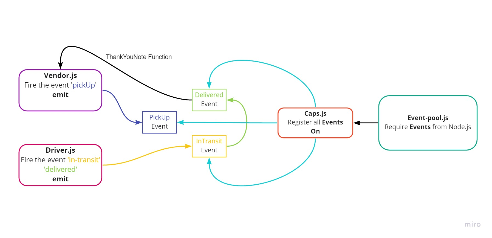
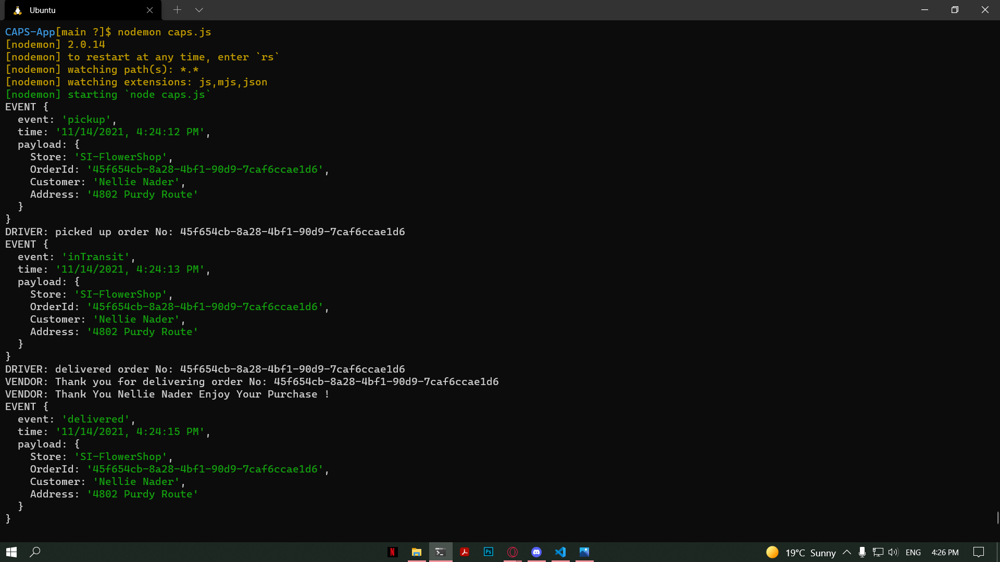
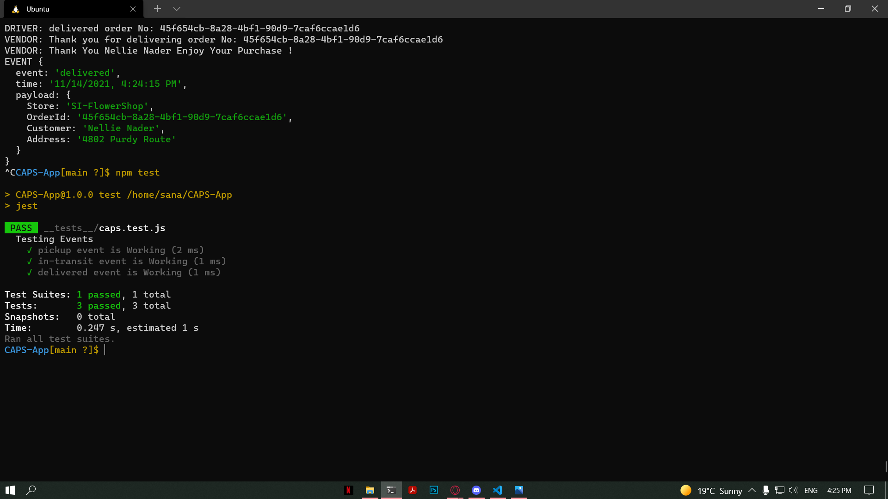

# CAPS-App

## LAB - 11
### Emit Events  
Author: Sana Ishaqat

[tests report (actions)](https://github.com/SanaIshaqat/CAPS-App/actions)

[back-end (heroku) For the Upcoming Labs](https://sana-CAPS-APP-401.herokuapp.com)

[PR Link](https://github.com/SanaIshaqat/CAPS-App/pull/1)

### Setup (In Upcoming Labs)
.env requirements
PORT - Port Number

### Running the app (In Upcoming Labs)
npm run dev
Endpoint: /status
Returns Object
{
  "status": "running",
  "port": 3030,
  "domain": "https://sana-CAPS-APP-401.herokuapp.com"
}
### UML

### Tests
Unit Tests: npm run test

